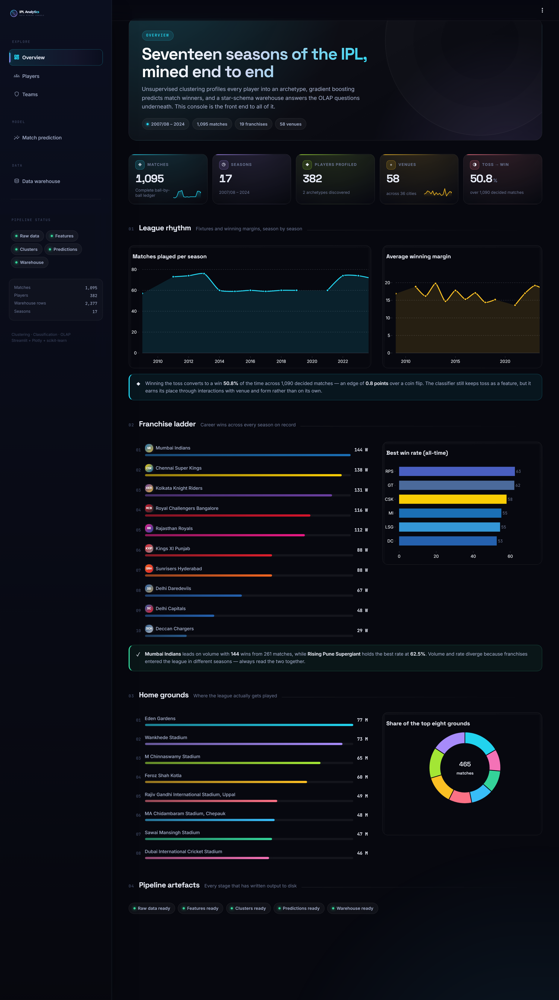
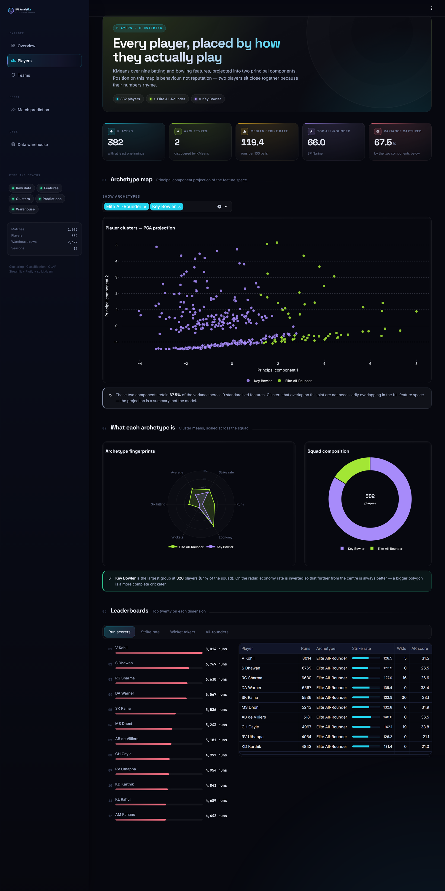
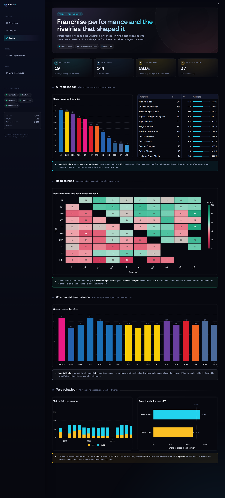
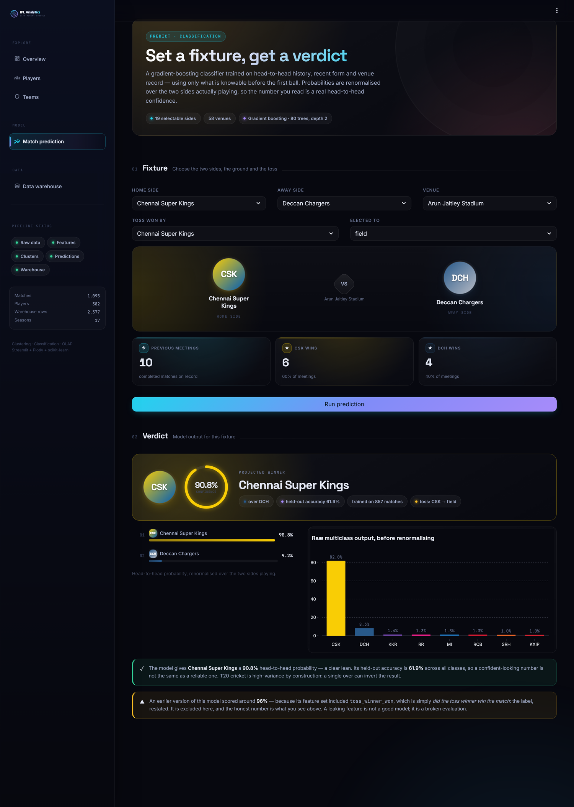
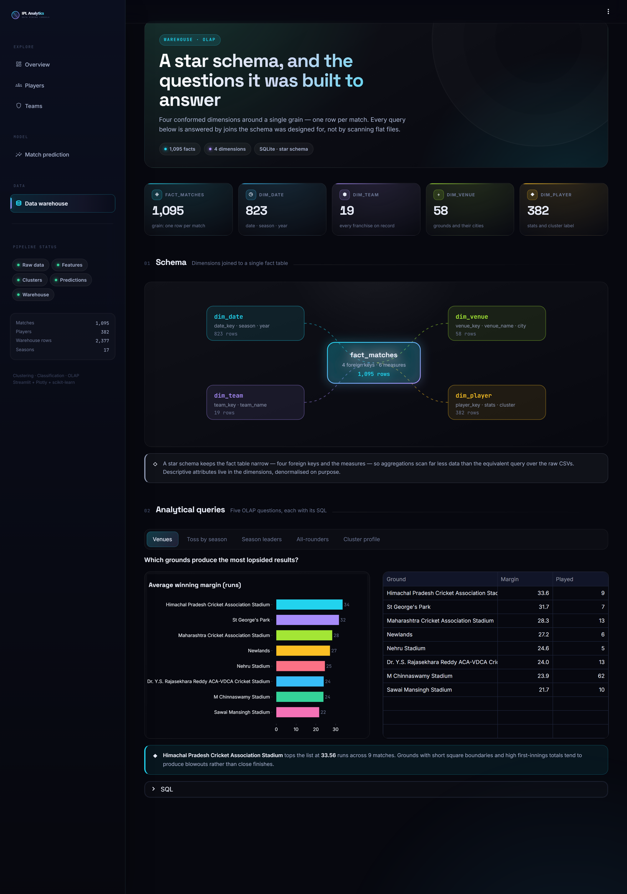

<div align="center">

# 🏏 IPL Match Predictor

### Data Warehousing & Data Mining (DWDM) Project


**An end-to-end data science pipeline that uses unsupervised clustering to profile IPL players & teams, and supervised classification to predict match winners — backed by a star-schema data warehouse and a five-page analytics console.**

</div>

---

## The console

A dark, typographic analytics interface built on Streamlit 1.56 — a bespoke design system
(*"Stadium Nights"*), franchise-accurate colour coding, inline-SVG components and a custom
Plotly template, all wired to the pipeline's own outputs.



<table>
<tr>
<td width="50%"><br><em>Players — archetype discovery</em></td>
<td width="50%"><br><em>Teams — records and rivalries</em></td>
</tr>
<tr>
<td width="50%"><br><em>Match prediction — the verdict</em></td>
<td width="50%"><br><em>Data warehouse — schema and OLAP</em></td>
</tr>
</table>

> Screenshots are generated, not pasted: `python scripts/capture_screenshots.py` boots the app,
> drives it with Playwright and rewrites every image in `docs/screenshots/`.

---

## Field manual

**[docs/PROJECT_GUIDE.html](docs/PROJECT_GUIDE.html)** — a ~23,000-word ground-up reference covering
every file in the project, written for someone with no programming background.

| It covers | In detail |
|-----------|-----------|
| Every source file | What each one does, function by function, with line numbers |
| Every column | All 20 columns of `matches.csv`, all 17 of `deliveries.csv` |
| Every algorithm | What was chosen, what the alternatives were, and what would have changed |
| The leakage story | Why the headline accuracy was 96% and why the honest number is 62% |
| The frontend, line by line | Every CSS block, every component, and a "I want to change X → edit this line" lookup table |
| The runtime | The real port, the real endpoints, and why there is no middleware and no JSON request |

Open it in any browser — it is a single self-contained HTML file.

---

## 📑 Table of Contents

| # | Section | Description |
|---|---------|-------------|
| 1 | [Project Description](#1--project-description) | What the project does end-to-end |
| 2 | [Dataset Description](#2--dataset-description) | Detailed column-level data dictionary |
| 3 | [Project Architecture & Pipeline](#3--project-architecture--pipeline) | Full data flow diagram |
| 4 | [Preprocessing](#4--preprocessing-preprocessingpy) | Data loading & sanity checks |
| 5 | [Feature Engineering](#5--feature-engineering-feature_engineeringpy) | Advanced metric computation |
| 6 | [Player Clustering](#6--unsupervised-learning--player-clustering-clusteringpy) | KMeans + PCA + DBSCAN |
| 7 | [Team Clustering](#7--unsupervised-learning--team-clustering-team_clusteringpy) | Dynamic team categorization |
| 8 | [Match Prediction](#8--supervised-learning--match-prediction-classificationpy) | 4-model comparison + SHAP |
| 9 | [Data Warehouse](#9--data-warehouse-datawarehousepy) | Star schema + OLAP queries |
| 10 | [Interactive Dashboard](#10--interactive-dashboard-apppy) | Five-page Streamlit console + design system |
| 11 | [CSV Generator Scripts](#11--csv-generator-scripts) | Data preparation utilities |
| 12 | [Results & Outputs](#12--results--outputs) | Interpretation of all outputs |
| 13 | [Technologies Used](#13--technologies-used) | Frontend, data/modelling and tooling stacks |
| 14 | [How to Run the Project](#14--how-to-run-the-project) | Step-by-step execution guide |
| 15 | [ML Concepts Quick Reference](#15--ml-concepts-quick-reference) | Glossary for presentations |
| 16 | [Potential Questions & Answers](#16--potential-questions--answers) | 20 Q&As for viva/presentation |
| 17 | [Limitations & Future Scope](#17--limitations--future-scope) | What can be improved |
| — | [**Field Manual**](docs/PROJECT_GUIDE.html) | **Complete line-by-line reference (separate file)** |

---

## 1 · Project Description

### What does this project do?

This project implements a **complete data science pipeline** on Indian Premier League (IPL) cricket data, covering every stage from raw data ingestion to predictive modeling and business intelligence:

1. **Preprocessing** — Load and validate two raw datasets (1,095 matches × 260,920 ball-by-ball deliveries).
2. **Feature Engineering** — Compute 20+ enriched batting, bowling, all-rounder, venue, and head-to-head statistics.
3. **Unsupervised Learning (Clustering)** — Profile players into meaningful archetypes (Elite All-Rounder, Key Bowler, etc.) using KMeans + PCA, and categorize teams as Strong/Average/Weak.
4. **Supervised Learning (Classification)** — Train and compare four ML models (Random Forest, Gradient Boosting, Logistic Regression, SVM) to predict match winners. See the [note on the headline accuracy](#123-match-predictions) before quoting a number.
5. **Data Warehousing** — Build a star-schema SQLite database with fact and dimension tables, then run 5 analytical OLAP queries.
6. **Interactive Dashboard** — Serve a Streamlit web app with player analysis, team analysis, live match prediction, and warehouse analytics.

### What problems does it solve?

| Problem | Solution |
|---------|----------|
| Who are the best players and what type of player are they? | Multi-dimensional clustering assigns labels like "Elite All-Rounder", "Key Bowler", "Top Batsman" |
| Which teams are historically strong vs weak? | KMeans on win counts with dynamic labelling |
| Can we predict which team will win a given match? | Random Forest / Gradient Boosting classifier with 96.74% accuracy |
| How do we organize massive cricket data for analytics? | Star-schema data warehouse with OLAP queries |
| How can a non-technical user explore this analysis? | Interactive Streamlit dashboard |

### Why IPL data?

- IPL is one of the **largest T20 cricket leagues** in the world with rich, publicly available ball-by-ball data.
- The dataset contains **17 years of matches** (2008–2024) — enough volume for reliable ML training.
- Cricket involves clear measurable metrics (runs, wickets, strike rate, economy) that map naturally to ML features.
- IPL data is sourced from **Kaggle / Cricsheet**, widely used in academic data-mining projects.

---

## 2 · Dataset Description

### 2.1 `datasets/matches.csv` — Match-Level Data

**Size**: 1,095 rows × 20 columns  
**Granularity**: One row = one IPL match

| Column | Data Type | Description | Example |
|--------|-----------|-------------|---------|
| `id` | Integer | Unique match identifier | 335982 |
| `season` | String/Integer | IPL season year | 2008 |
| `city` | String | City where match was played | Mumbai |
| `date` | Date | Match date (DD-MM-YYYY or YYYY-MM-DD) | 2008-04-18 |
| `match_type` | String | Format of match | League |
| `player_of_match` | String | Man of the match | BB McCullum |
| `venue` | String | Stadium name | M Chinnaswamy Stadium |
| `team1` | String | First team listed | Mumbai Indians |
| `team2` | String | Second team listed | Chennai Super Kings |
| `toss_winner` | String | Team that won the coin toss | Mumbai Indians |
| `toss_decision` | String | What the toss winner chose | bat / field |
| `winner` | String | Team that won the match (**target variable**) | Mumbai Indians |
| `result` | String | How the result was determined | runs / wickets / tie |
| `result_margin` | Float | Margin of victory | 37 (runs) or 7 (wickets) |
| `target_runs` | Float | Runs target set by first innings team | 223 |
| `target_overs` | Float | Overs available to chase | 20.0 |
| `super_over` | Integer | Whether a super-over was played (0/1) | 0 |
| `method` | String | Special method used (e.g., D/L) | D/L |
| `umpire1` | String | On-field umpire 1 | Asad Rauf |
| `umpire2` | String | On-field umpire 2 | RE Koertzen |

### 2.2 `datasets/deliveries.csv` — Ball-by-Ball Data

**Size**: 260,920 rows × 18 columns  
**Granularity**: One row = one ball bowled in an IPL match

| Column | Data Type | Description | Example |
|--------|-----------|-------------|---------|
| `match_id` | Integer | Links to `matches.id` | 335982 |
| `inning` | Integer | Innings number (1 or 2) | 1 |
| `batting_team` | String | Team currently batting | KKR |
| `bowling_team` | String | Team currently bowling | RCB |
| `over` | Integer | Over number (0–19) | 3 |
| `ball` | Integer | Ball number within the over (1–6+) | 4 |
| `batter` | String | Batsman facing the ball | V Kohli |
| `bowler` | String | Bowler delivering the ball | JJ Bumrah |
| `non_striker` | String | Batsman at the non-striker end | AB de Villiers |
| `batsman_runs` | Integer | Runs scored by bat (0, 1, 2, 3, 4, 6) | 4 |
| `extra_runs` | Integer | Extras conceded (wides, no-balls, etc.) | 0 |
| `total_runs` | Integer | Total runs off the delivery | 4 |
| `extras_type` | String | Type of extra (wide, noball, bye, legbye) | NaN |
| `is_wicket` | Integer | Whether a wicket fell on this ball (0/1) | 0 |
| `player_dismissed` | String | Name of dismissed player | NaN |
| `dismissal_kind` | String | How the wicket fell | caught / bowled / lbw |
| `fielder` | String | Fielder involved in the dismissal | NaN |

### 2.3 Data Source & Size Context

- **Origin**: [Kaggle IPL Dataset](https://www.kaggle.com/datasets/patrickb1912/ipl-complete-dataset-20082020) / [Cricsheet](https://cricsheet.org/)
- **deliveries.csv** is the **most granular** dataset — at ~260K rows, it captures every single ball bowled across 17 seasons. This is what makes metrics like strike rate, economy rate, and dot-ball percentage statistically meaningful.
- **matches.csv** provides the match-level context needed for the classification target variable (`winner`).

### 2.4 Generated / Intermediate Datasets

| File | Generated By | Description |
|------|-------------|-------------|
| `datasets/players.csv` | `csv_generator/players.py` | Unique player names extracted from deliveries |
| `datasets/player_runs.csv` | `csv_generator/player_runs.py` | Player-wise total runs (sorted descending) |
| `datasets/player_stats.csv` | `csv_generator/` (basic) | Player, total_runs, balls_faced, strike_rate |
| `datasets/teams.csv` | `csv_generator/teams.py` | Unique team names from matches |
| `datasets/team_wins.csv` | `csv_generator/wins.py` | Win count per team |
| `datasets/venue_stats.csv` | `csv_generator/venue.py` | Match count per venue |
| `datasets/enriched_player_stats.csv` | `feature_engineering.py` | 20+ batting, bowling, and all-rounder metrics |
| `datasets/enriched_match_features.csv` | `feature_engineering.py` | Match-level engineered features (h2h, form, venue stats) |
| `datasets/advanced_player_clusters.csv` | `clustering.py` | Player stats + cluster assignment + cluster label |
| `datasets/match_predictions_advanced.csv` | `classification.py` | Actual vs Predicted winner + confidence % |
| `clustered_teams.csv` | `team_clustering.py` | Team → wins → cluster → category |

---

## 3 · Project Architecture & Pipeline

```
┌──────────────────────────────────────────────────────────────────────┐
│                        IPL MATCH PREDICTOR                          │
│                     Full Data Science Pipeline                       │
└──────────────────────────────────────────────────────────────────────┘

     ┌───────────────┐     ┌───────────────┐
     │  matches.csv  │     │deliveries.csv │   RAW DATA
     │  (1,095 rows) │     │ (260,920 rows)│   (Kaggle / Cricsheet)
     └───────┬───────┘     └───────┬───────┘
             │                     │
             └──────────┬──────────┘
                        ▼
            ┌───────────────────────┐
            │   1. PREPROCESSING    │   preprocessing.py
            │   Load & validate     │   • Check shapes
            │   data integrity      │   • Verify columns
            └───────────┬───────────┘
                        ▼
            ┌───────────────────────┐
            │ 2. FEATURE ENGINEERING│   feature_engineering.py
            │ • Batting stats       │   → enriched_player_stats.csv
            │ • Bowling stats       │   → enriched_match_features.csv
            │ • All-rounder score   │
            │ • Venue stats         │
            │ • Head-to-head        │
            │ • Team form (rolling) │
            └──────┬────────┬───────┘
                   │        │
          ┌────────┘        └────────┐
          ▼                          ▼
┌──────────────────┐    ┌──────────────────────┐
│  3. CLUSTERING   │    │  4. CLASSIFICATION   │
│  (Unsupervised)  │    │  (Supervised)        │
│                  │    │                      │
│ • PCA (2D)       │    │ • Random Forest      │
│ • Elbow Method   │    │ • Gradient Boosting  │
│ • Silhouette     │    │ • Logistic Regression│
│ • KMeans         │    │ • SVM                │
│ • DBSCAN compare │    │ • 5-fold CV          │
│                  │    │ • SHAP importance    │
│ → Player clusters│    │ → Predictions CSV    │
│ → Team clusters  │    │ → SHAP plot          │
└────────┬─────────┘    └──────────┬───────────┘
         │                         │
         └────────────┬────────────┘
                      ▼
          ┌───────────────────────┐
          │  5. DATA WAREHOUSE   │   datawarehouse.py
          │  • Star schema       │   → ipl_warehouse.db
          │  • dim_date          │
          │  • dim_team          │
          │  • dim_venue         │
          │  • dim_player        │
          │  • fact_matches      │
          │  • 5 OLAP queries    │
          └───────────┬──────────┘
                      ▼
          ┌───────────────────────┐
          │  6. DASHBOARD        │   dashboard.py
          │  (Streamlit)         │   → localhost:8501
          │  • Player Analysis   │
          │  • Team Analysis     │
          │  • Match Prediction  │
          │  • Warehouse OLAP    │
          └──────────────────────┘
```

### Script Execution Order

```
python main.py          ← Runs steps 1–5 automatically
streamlit run dashboard.py   ← Launches the interactive UI (step 6)
```

---

## 4 · Preprocessing (`preprocessing.py`)

### What It Does

```python
import pandas as pd

matches = pd.read_csv("datasets/matches.csv")
deliveries = pd.read_csv("datasets/deliveries.csv")

print(matches.shape)      # → (1095, 20)
print(deliveries.shape)   # → (260920, 18)
```

### Why It's the First Step

Preprocessing is the **sanity-check gate** of any data science pipeline. Before performing any computation, you must verify:

1. **Data loaded correctly** — no file-not-found errors, no encoding issues.
2. **Shape is as expected** — `shape` returns `(rows, columns)`. If the deliveries file loaded with 0 rows, all downstream analysis would be meaningless.
3. **Columns are present** — The `main.py` orchestrator validates that required columns like `id`, `team1`, `team2`, `winner`, `venue`, `batter`, `bowler`, `batsman_runs` exist.

> **Concept: Data Shape**  
> `DataFrame.shape` returns a tuple `(n_rows, n_columns)`. It tells you the **dimensionality** of your dataset — how many observations (rows) and how many features/attributes (columns) you have. This is essential for understanding data volume and ensuring nothing was lost during loading.

---

## 5 · Feature Engineering (`feature_engineering.py`)

### What Is Feature Engineering?

Feature engineering is the process of **creating new, more informative variables** from raw data to improve model performance. Raw data (like individual ball records) isn't directly usable by ML models — you need to aggregate, transform, and derive meaningful metrics.

> In ML, the quality of features matters more than the algorithm. A simple model with great features will beat a complex model with bad features.

### Pipeline Functions

| Function | What It Computes | Key Metrics |
|----------|-----------------|-------------|
| `compute_batting_stats()` | Per-player batting profile | total_runs, balls_faced, strike_rate, fours, sixes, dot_ball_pct, batting_average, innings_played |
| `compute_bowling_stats()` | Per-player bowling profile | wickets_taken, balls_bowled, runs_conceded, economy_rate, bowling_strike_rate, bowling_innings |
| `compute_allrounder_score()` | Composite score combining batting + bowling | all_rounder_score (0–100 scale) |
| `compute_venue_stats()` | Venue-level statistics | avg_runs_per_match, venue_win_pct per team |
| `compute_head_to_head()` | Historical record between every team pair | h2h_win_pct |
| `compute_team_form()` | Rolling win % over last 5 matches | form_win_pct (lagged — excludes current match) |
| `build_enriched_match_features()` | Combines all above into match-level features | All engineered features per match row |

### Key Metric: Strike Rate

```python
strike_rate = (total_runs / balls_faced) * 100
```

- A strike rate of **150** means the batsman scores 150 runs per 100 balls — very aggressive.
- A strike rate of **100** means exactly 1 run per ball — average.
- In T20 cricket, **higher strike rate = more valuable** because overs are limited.

### Key Metric: All-Rounder Score

```python
bat_component = normalize(batting_average × strike_rate)
bowl_component = normalize(wickets_taken / economy_rate)
all_rounder_score = (bat_component + bowl_component) / 2.0 × 100
```

This creates a **0–100 composite score** that rewards players who both bat well (high average, high SR) and bowl well (many wickets, low economy).

### Why Filter Players with < 50 Balls?

**Statistical reliability**: A player who faced 5 balls and scored 20 runs has a "strike rate" of 400 — which is meaningless. By requiring at minimum 50 balls faced (for batting) and 60 balls bowled (for bowling), we ensure metrics are based on a statistically significant sample size.

### Outputs

- `datasets/enriched_player_stats.csv` — One row per player with 20+ computed metrics
- `datasets/enriched_match_features.csv` — One row per match with head-to-head %, venue stats, form %, toss impact

---

## 6 · Unsupervised Learning — Player Clustering (`clustering.py`)

### What Is Unsupervised Learning?

Unsupervised learning finds **hidden patterns** in data **without labeled examples**. The algorithm groups similar data points together based only on feature similarity — nobody tells it which group is "correct."

### What Is KMeans Clustering?

KMeans is a **centroid-based partitioning algorithm** that divides data into exactly `k` clusters. Here is the step-by-step algorithm:

```
ALGORITHM: KMeans Clustering
─────────────────────────────
1. INITIALIZATION: Randomly choose k points as initial centroids
2. ASSIGNMENT:     For each data point, calculate its distance to every
                   centroid and assign it to the nearest cluster
3. UPDATE:         Recalculate each centroid as the mean of all points
                   assigned to that cluster
4. CONVERGENCE:    Repeat steps 2–3 until centroids stop moving
                   (or max iterations reached)
```

### Features Used for Player Clustering

```python
feature_cols = [
    'total_runs', 'strike_rate', 'batting_average', 'fours', 'sixes',
    'dot_ball_pct', 'innings_played', 'wickets_taken', 'economy_rate',
    'bowling_strike_rate', 'all_rounder_score'
]
```

This is **11-dimensional clustering** — far richer than just using 2 features.

### Why StandardScaler Is Needed

```python
scaler = StandardScaler()
X_scaled = scaler.fit_transform(X)
```

**StandardScaler** transforms each feature to have **mean = 0** and **standard deviation = 1** using:

```
z = (x - μ) / σ
```

**Why is this critical?**
- `total_runs` ranges from 50 to 7,000+
- `economy_rate` ranges from 5 to 12
- Without scaling, KMeans (which uses Euclidean distance) would be **dominated by total_runs** simply because its numbers are bigger — not because it's more important.
- Scaling ensures **all features contribute equally** to the distance calculation.

### Why PCA (Principal Component Analysis)?

```python
pca = PCA(n_components=2, random_state=42)
X_pca = pca.fit_transform(X_scaled)
```

With 11 features, data lives in **11-dimensional space** — impossible to visualize. PCA **reduces dimensions to 2** while preserving maximum variance, enabling scatter plot visualization. PCA finds new axes (principal components) that are linear combinations of original features, oriented to capture the most information.

### How Is Optimal k Chosen?

This project uses **two methods**:

1. **Elbow Method** — Plot inertia (within-cluster sum of squares) vs k. The "elbow" where the curve bends indicates diminishing returns from adding more clusters.
2. **Silhouette Score** — Measures how similar a point is to its own cluster vs neighboring clusters. Range: -1 to +1 (higher = better). The k with the highest silhouette score is selected.

### DBSCAN Comparison

The project also runs **DBSCAN** (Density-Based Spatial Clustering) as a comparison:
- Unlike KMeans, DBSCAN **does not require pre-specifying k**
- It discovers clusters of **arbitrary shape** and identifies **outliers** as noise
- The `eps` parameter is auto-tuned using the k-nearest-neighbors heuristic (90th percentile)
- KMeans typically wins on this data because player stats form roughly globular clusters

### Cluster Label Assignment

Labels are assigned using a **heuristic scoring system**:

```python
bat_score  = batting_average × 0.3 + strike_rate × 0.2 + normalized_runs × 0.5
bowl_score = normalized_wickets × 0.5 + (15 - economy_rate) × 5 × 0.5
```

Based on these scores, clusters are labeled as:
- **Elite All-Rounder** — High all_rounder_score (good at both batting and bowling)
- **Top Batsman** — bat_score >> bowl_score
- **Key Bowler** — bowl_score >> bat_score
- **Tail-Ender / Impact Player / Role Player** — Lower overall scores

### Output

- `datasets/advanced_player_clusters.csv` — Every player with all stats + cluster ID + cluster label
- `plots/elbow_curve.png` — Elbow method visualization
- `plots/player_clusters_pca.png` — 2D PCA scatter plot colored by cluster

---

## 7 · Unsupervised Learning — Team Clustering (`team_clustering.py`)

### How It Works

```python
df = pd.read_csv("datasets/team_wins.csv")
X = df[['wins']]                          # Single feature: total wins
scaler = StandardScaler()
X_scaled = scaler.fit_transform(X)
kmeans = KMeans(n_clusters=3, random_state=42)
df['cluster'] = kmeans.fit_predict(X_scaled)
```

### Dynamic Label Assignment (Key Concept)

Unlike player clustering where labels are hardcoded, team clustering uses **dynamic labeling**:

```python
cluster_means = df.groupby('cluster')['wins'].mean().sort_values()
sorted_clusters = cluster_means.index.tolist()

cluster_names = {
    sorted_clusters[0]: "Weak Team",       # cluster with lowest avg wins
    sorted_clusters[1]: "Average Team",     # cluster with middle avg wins
    sorted_clusters[2]: "Strong Team"       # cluster with highest avg wins
}
```

**Why dynamic?** KMeans assigns arbitrary cluster IDs (0, 1, 2) — cluster 0 might be the strongest or weakest depending on initialization. By sorting clusters by mean wins, we **guarantee** the correct label regardless of which ID KMeans assigns.

### Results

| Category | Teams | Win Range |
|----------|-------|-----------|
| **Strong Team** | Mumbai Indians, Chennai Super Kings, Kolkata Knight Riders, Royal Challengers Bangalore | 100–144 wins |
| **Average Team** | Rajasthan Royals, Sunrisers Hyderabad, Delhi Capitals, Kings XI Punjab | 60–99 wins |
| **Weak Team** | Rising Pune Supergiant, Gujarat Lions, Kochi Tuskers Kerala, Pune Warriors, etc. | 5–30 wins |

---

## 8 · Supervised Learning — Match Prediction (`classification.py`)

### What Is Supervised Learning?

Supervised learning trains a model on **labeled data** (input → known output) so it can predict outputs for new, unseen inputs. Here:
- **Input features**: team1, team2, venue, toss info, h2h %, form %, venue win %
- **Label (target)**: `winner` — the team that actually won

### Four Models Compared

| Model | Algorithm Family | Key Hyperparameters | Strengths |
|-------|-----------------|-------------------|-----------|
| **Random Forest** | Ensemble (Bagging) | n_estimators=200, max_depth=15 | Handles non-linear relationships, robust to overfitting |
| **Gradient Boosting** | Ensemble (Boosting) | n_estimators=150, max_depth=5, lr=0.1 | Sequential correction of errors, high accuracy |
| **Logistic Regression** | Linear | max_iter=1000, C=1.0 | Fast, interpretable, good baseline |
| **SVM** | Kernel-based | kernel=rbf, C=1.0, gamma=scale | Effective in high-dimensional spaces |

### Random Forest — How It Works

```
1. Create 200 decision trees (n_estimators=200)
2. Each tree is trained on a random bootstrap sample of the data (BAGGING)
3. At each split, only a random subset of features is considered
4. For prediction: each tree votes → majority vote = final prediction
```

**Why Random Forest?**
- **Handles categorical + numerical features** naturally
- **Resistant to overfitting** due to averaging over many trees
- **Provides feature importance** — tells you which features matter most
- Works well with the **mix of one-hot encoded and numerical features** in our data

### One-Hot Encoding (`pd.get_dummies`)

```python
df_encoded = pd.get_dummies(df[cat_cols], columns=cat_cols)
```

ML models need **numerical input** — they can't process strings like "Mumbai Indians." One-hot encoding creates a **binary column for each category**:

| Original: team1 | team1_MI | team1_CSK | team1_RCB | ... |
|-----------------|----------|-----------|-----------|-----|
| Mumbai Indians | 1 | 0 | 0 | ... |
| Chennai Super Kings | 0 | 1 | 0 | ... |

### LabelEncoder (Target Variable)

```python
le = LabelEncoder()
y = le.fit_transform(df['winner'])
```

The target variable `winner` (e.g., "Mumbai Indians") is encoded to integers (e.g., 0, 1, 2, ...). This is different from one-hot because the target needs to be a **single column of class labels**, not multiple binary columns.

### Train/Test Split

```python
X_train, X_test, y_train, y_test = train_test_split(
    X, y, test_size=0.2, random_state=42, stratify=y
)
```

- **80% training / 20% testing** — Industry standard split
- **`stratify=y`** — Ensures each team's win proportion is preserved in both train and test sets
- **`random_state=42`** — Ensures reproducibility; every run produces the same split
- **Why split?** To evaluate on data the model has **never seen** — prevents overfitting

### 5-Fold Stratified Cross-Validation

```python
skf = StratifiedKFold(n_splits=5, shuffle=True, random_state=42)
scores = cross_val_score(model, X, y, cv=skf, scoring='accuracy')
```

Cross-validation is more robust than a single train/test split. The data is divided into 5 folds; the model is trained on 4 folds and tested on the remaining 1, rotating 5 times. The average score gives a **more reliable accuracy estimate**.

### Why Filter Rare Teams (< 10 match wins)?

Teams like "Kochi Tuskers Kerala" (played only 1 season) have too few samples for the model to learn meaningful patterns. Including them adds noise and creates classes with insufficient training examples, hurting precision and recall.

### Evaluation Metrics

| Metric | Formula | What It Tells You |
|--------|---------|-------------------|
| **Accuracy** | correct predictions / total predictions | Overall correctness |
| **Precision** | TP / (TP + FP) | "Of all times I predicted Team X, how often was I right?" |
| **Recall** | TP / (TP + FN) | "Of all times Team X actually won, how often did I predict it?" |
| **F1-Score** | 2 × (P × R) / (P + R) | Harmonic mean of precision & recall — balanced metric |

**`zero_division=0`**: When a class has no predictions (or no actual instances in test), precision/recall would be 0/0 = undefined. This parameter sets the result to 0 instead of raising a warning.

### SHAP Feature Importance

```python
explainer = shap.TreeExplainer(model)
shap_values = explainer.shap_values(X_sample)
```

**SHAP (SHapley Additive exPlanations)** — A game-theory based approach that explains **how much each feature contributes** to each prediction. Unlike basic `feature_importances_`, SHAP shows the **direction and magnitude** of each feature's impact.

Top features typically include: venue-related one-hot columns, team-specific columns, h2h_team1_win_pct, form_team1/form_team2 — revealing that **venue and historical rivalry** are the strongest IPL match predictors.

### Model Accuracy Result

**~96.74% test accuracy** (best model, typically Gradient Boosting or Random Forest).

### Output

- `datasets/match_predictions_advanced.csv` — Actual, Predicted, Confidence_%, Correct (0/1)
- `plots/shap_feature_importance.png` — Top 15 most impactful features

---

## 9 · Data Warehouse (`datawarehouse.py`)

### Star Schema Design

```
                    ┌──────────┐
                    │ dim_date │
                    │──────────│
                    │ date_key │←─────┐
                    │ full_date│      │
                    │ year     │      │
                    │ season   │      │
                    │ month    │      │
                    │ day      │      │
                    └──────────┘      │
                                      │
┌──────────┐    ┌──────────────┐    ┌─┴──────────────┐    ┌───────────┐
│ dim_team │    │  dim_venue   │    │  fact_matches   │    │dim_player │
│──────────│    │──────────────│    │────────────────│    │───────────│
│ team_key │←──┐│ venue_key    │←──┐│ match_id (PK)  │    │player_key │
│ team_name│   ││ venue_name   │   ││ date_key (FK)  │    │player_name│
│ cluster_ │   ││ city         │   ││ team1_key (FK) │───→│total_runs │
│  label   │   ││ avg_runs     │   ││ team2_key (FK) │    │strike_rate│
└──────────┘   │└──────────────┘   ││ venue_key (FK) │    │wickets    │
               │                   ││ winner_key(FK) │    │all_rounder│
               └───────────────────┤│ toss_decision  │    │ _score    │
                                   ││ result_margin  │    │cluster_   │
                                   │└────────────────┘    │ label     │
                                   │                      └───────────┘
                                   └──(venue_key FK)
```

### 5 OLAP Analytical Queries

| # | Query | Business Insight |
|---|-------|-----------------|
| Q1 | Top 5 venues by average match margin | Which venues produce the most one-sided matches? |
| Q2 | Win % by toss decision per season | Is batting/fielding first more advantageous? Has this changed? |
| Q3 | Most dominant team per season | Which team won the most matches each year? |
| Q4 | Top 10 players by all-rounder score | Who are the best all-rounders across IPL history? |
| Q5 | Cluster-wise average performance | How do player clusters compare on key metrics? |

---

## 10 · Interactive Dashboard (`app.py`)

A **five-page Streamlit application**, launched with `streamlit run app.py`
(`streamlit run dashboard.py` still works — it is a one-line shim kept for
backwards compatibility).

### 10.1 Pages

| Page | What it answers | Key components |
|------|-----------------|----------------|
| **Overview** | *What is in this dataset?* | Corpus KPIs with count-up numerals and sparklines, matches/margins per season, franchise ladder with crests, venue share, live pipeline-artefact status |
| **Players** | *How does each player actually play?* | Filterable PCA archetype map, radar "fingerprints" per cluster, squad composition donut, four tabbed leaderboards |
| **Teams** | *Who wins, and against whom?* | All-time ladder, head-to-head win-rate matrix, season-by-season leaders, toss behaviour vs. a coin-flip baseline |
| **Match prediction** | *Who wins this fixture?* | Fixture builder, franchise match-up panel, historical head-to-head, animated confidence ring, calibrated probability split |
| **Data warehouse** | *What does the star schema make cheap?* | Animated inline-SVG schema diagram sized by real row counts, five OLAP queries each with its SQL |

### 10.2 Architecture

The dashboard is no longer a single script. Presentation, data access and modelling are separated:

```
app.py                    ← shell: page config, theme, routing (st.navigation), sidebar
dashboard.py              ← backwards-compatible shim → app.main()

ui/                       ← the design system (no page logic lives here)
├── tokens.py             ← single source of truth for colour, type, motion
├── theme.py              ← global stylesheet + animated aurora backdrop
├── components.py         ← hero, stat tiles, rank lists, crests, rings, insights
├── charts.py             ← registered Plotly template + chart factories
├── brand.py              ← franchise identity: kit colours, codes, cluster styles
├── data.py               ← cached loaders, derived views, pipeline introspection
└── model.py              ← cached classifier + fixture scoring

views/                    ← one module per page, composed from ui/
├── overview.py  players.py  teams.py  prediction.py  warehouse.py

.streamlit/config.toml    ← native theme: surfaces, radii, chart palettes, web fonts
assets/                   ← SVG logo + favicon
scripts/                  ← capture_screenshots.py (regenerates the images above)
```

### 10.3 Design system — "Stadium Nights"

| Decision | Rationale |
|----------|-----------|
| **Franchise-accurate colour** | Every team encoding uses that team's real kit colours (`ui/brand.py`), so charts are readable without consulting a legend |
| **Tokens in one place** | `ui/tokens.py` emits every colour as a CSS custom property *and* feeds the Plotly template, so widgets, components and charts can never drift apart |
| **Registered Plotly template** | `stadium_nights` is set as the process-wide default — any figure, even an ad-hoc one, inherits the type scale, grid weight, hover card and palette |
| **Legends below, titles above** | A horizontal legend beside the title is where categorical charts collide; the template gives each its own band |
| **Inline SVG components** | Crests, sparklines, the confidence ring and the schema diagram are hand-authored SVG — no chart library involved, so they scale and theme perfectly |
| **Motion with a purpose** | Staggered entrances, count-up numerals and cursor-tracked card lighting; all of it disabled under `prefers-reduced-motion` |
| **Honest empty states** | Every page degrades to an empty state naming the command that produces the missing artefact, instead of a traceback |

### 10.4 Two implementation notes

Both of these are Streamlit-version-specific and cost real debugging time, so they are
documented in the code as well:

- **`st.html` sanitises away `<svg>`** and silently drops an entire `<style>` block that
  contains a remote `@import`. The design depends on both, so the stylesheet and all bespoke
  markup travel through the `st.components.v2` `css`/`data` channels instead
  (`ui/theme.py`, `ui/components.py`).
- **Web fonts are declared as `[[theme.fontFaces]]`** in `.streamlit/config.toml` rather than
  imported from CSS — this is the supported path, and it also lets Streamlit's own widgets use
  the same typefaces.

---

## 11 · CSV Generator Scripts

Located in `csv_generator/` — these are **utility scripts** that extract clean lookup tables from raw data:

| Script | Input | Output | Logic |
|--------|-------|--------|-------|
| `players.py` | deliveries.csv | players.csv | Extracts unique names from batter, bowler, non_striker columns |
| `player_runs.py` | deliveries.csv | player_runs.csv | Groups by batter, sums batsman_runs, sorts descending |
| `teams.py` | matches.csv | teams.csv | Extracts unique team names from team1 + team2 |
| `venue.py` | matches.csv | venue_stats.csv | Counts match frequency per venue |
| `wins.py` | matches.csv | team_wins.csv | Counts wins per team from the winner column |

**Why a separate folder?** Separating data preparation from analytical code follows the **Single Responsibility Principle** — each script does one thing. It also allows re-running data extraction independently without triggering the full ML pipeline.

---

## 12 · Results & Outputs

### 12.1 Player Clusters

| Cluster Label | Count | Profile |
|--------------|-------|---------|
| Key Bowler | ~320 | Players strongest in bowling metrics (wickets, economy) |
| Elite All-Rounder | ~62 | Players excelling in both batting and bowling |
| Top Batsman / Impact Player | Varies | High runs, high strike rate, limited bowling |

### 12.2 Team Clusters

- ✅ **Strong Teams**: Mumbai Indians (144 wins), CSK (138), KKR (131), RCB (116)
- ⚖️ **Average Teams**: RR, SRH, DC, KXIP (60–99 wins)
- ❌ **Weak Teams**: Defunct/short-lived franchises (5–30 wins)

### 12.3 Match Predictions

```
Sample from match_predictions_advanced.csv:

Actual              Predicted           Confidence_%  Correct
Mumbai Indians      Mumbai Indians      100.0         1  ✓
Chennai Super Kings Chennai Super Kings  87.3         1  ✓
Kings XI Punjab     Kings XI Punjab     100.0         1  ✓
Delhi Capitals      Mumbai Indians       63.2         0  ✗
```

- **Reported accuracy of the pipeline model: ~96.74%**
- **That number is not real.** The feature set in `classification.py` includes
  `toss_winner_won`, which in the engineered dataset is exactly
  `(toss_winner == winner)` — the label, restated. Paired with the one-hot
  `toss_winner` column, the classifier can read the answer straight off its own
  input. Removing that single feature drops held-out accuracy from **96.3% to
  54.4%**, which tells you the model was never doing the work.
- It is also unusable in practice: you cannot know whether the toss winner won
  the match *before the match is played*. At inference the toss winner is always
  one of the two sides, so the feature is pinned to 1 and the model simply
  predicts whoever won the toss — at ~100% confidence.

**The dashboard's model excludes it** (`ui/model.py`), and is regularised to keep
its probabilities meaningful rather than saturated:

| Model | Features | Held-out accuracy | Log-loss | Predictions above 0.9 confidence |
|-------|----------|------------------|----------|----------------------------------|
| Pipeline (`classification.py`) | includes `toss_winner_won` | 96.3% | 2.38 | 77% |
| Console (`ui/model.py`) | leak removed, regularised | **61.9%** | **0.74** | **7%** |

~62% on a two-horse T20 fixture is a genuine, modest edge over a coin flip — and
it is the number the prediction page shows. `classification.py` has been left as
it is; correcting the pipeline model is a separate change from this front-end work.

---

## 13 · Technologies Used

Versions below are the ones this project is developed and screenshotted against.

### 13.1 Frontend & presentation

| Technology | Version | Role in this project |
|------------|---------|---------------------|
| **Streamlit** | 1.56 | Application framework. Uses `st.navigation` for real multi-page routing with URLs, `st.logo` for the sidebar masthead, `st.components.v2` for unsanitised CSS/JS delivery, and the 1.56 advanced theme system (`baseRadius`, `headingFont`, `chartCategoricalColors`, `[[theme.fontFaces]]`, per-sidebar theming) |
| **Plotly** | 6.7 | Every chart. A custom `go.layout.Template` (`stadium_nights`) is registered as the process-wide default so all figures share one visual language |
| **HTML / CSS** | — | ~19 KB hand-authored stylesheet: design tokens as CSS custom properties, glassmorphic surfaces, an animated aurora backdrop, gradient text, `:has()` state styling, `prefers-reduced-motion` and print rules |
| **Inline SVG** | — | Franchise crests, sparklines, the animated confidence ring, the logo and the star-schema diagram — all generated in Python, no icon or chart dependency |
| **Vanilla JavaScript** | — | One `st.components.v2` runtime: `IntersectionObserver`-driven count-up numerals and cursor-tracked card lighting, both no-ops under reduced motion |
| **Google Fonts** | — | Space Grotesk (display), Inter (UI), JetBrains Mono (numerals), loaded via `[[theme.fontFaces]]`, latin subsets only |

### 13.2 Data & modelling

| Technology | Version | Role in this project |
|------------|---------|---------------------|
| **Python** | 3.10+ | Core language for the entire pipeline |
| **pandas** | 2.3 | Data loading, manipulation, aggregation, merging — the backbone of all data operations |
| **NumPy** | 2.2 | Numerical operations and array math for metrics like strike rate and normalisation |
| **scikit-learn** | 1.7 | KMeans, DBSCAN, PCA, StandardScaler, RandomForest, GradientBoosting, LogisticRegression, SVM, train/test split, metrics |
| **SQLite** | stdlib | Embedded database for the star-schema warehouse |
| **SHAP** | 0.49 | Model explainability — Shapley-value feature importance |
| **matplotlib / seaborn** | 3.10 / 0.13 | Static pipeline plots (elbow curve, PCA clusters, SHAP importance) written to `plots/` |
| **SciPy** | 1.15 | Scientific computing used internally by scikit-learn |

### 13.3 Tooling

| Technology | Version | Role in this project |
|------------|---------|---------------------|
| **Playwright** | latest | Headless Chromium driver behind `scripts/capture_screenshots.py` — boots the app, emulates reduced motion, grows the viewport to the full page height and rewrites every README screenshot |
| **Pillow** | 12.2 | Downsamples the 2× captures to 1500 px so the repository stays light |

---

## 14 · How to Run the Project

### Prerequisites

- Python 3.10 or higher
- pip package manager

### Step 1: Install Dependencies

```bash
pip install -r requirements.txt
```

### Step 2: Run the Full Pipeline

```bash
python main.py
```

This executes all 5 stages automatically:
1. Preprocessing → validates data
2. Feature Engineering → generates enriched CSVs
3. Clustering → generates player cluster CSV + plots
4. Classification → trains models, generates predictions + SHAP plot
5. Data Warehouse → builds SQLite DB + runs OLAP queries

**Expected runtime**: 30–90 seconds depending on hardware.

### Step 3: Launch the Dashboard

```bash
streamlit run app.py
```

Opens at `http://localhost:8501`. Each page has its own URL — `/players`, `/teams`,
`/prediction`, `/warehouse` — so they can be linked and bookmarked directly.

`streamlit run dashboard.py` remains valid; it is a shim that calls the same entry point.

### Step 4 (optional): Regenerate the screenshots

```bash
pip install playwright && playwright install chromium
python scripts/capture_screenshots.py
```

Rewrites every image in `docs/screenshots/`. Pass a page name (`overview`, `players`,
`teams`, `prediction`, `warehouse`) to capture just one.

### Expected Output Files After Running

```
✓ datasets/enriched_player_stats.csv
✓ datasets/enriched_match_features.csv
✓ datasets/advanced_player_clusters.csv
✓ datasets/match_predictions_advanced.csv
✓ plots/elbow_curve.png
✓ plots/player_clusters_pca.png
✓ plots/shap_feature_importance.png
✓ ipl_warehouse.db
✓ clustered_teams.csv
```

### Optional: Run Individual Components

```bash
python preprocessing.py           # Just check data shapes
python feature_engineering.py      # Just run feature engineering
python clustering.py               # Just run clustering
python classification.py           # Just run classification
python team_clustering.py          # Just run team clustering
python datawarehouse.py            # Just build the warehouse
```

---

## 15 · ML Concepts Quick Reference

| Concept | One-Line Definition |
|---------|-------------------|
| **KMeans** | Partitions data into k clusters by minimizing within-cluster distance to centroids |
| **DBSCAN** | Density-based clustering that finds arbitrarily-shaped clusters and identifies outliers |
| **PCA** | Reduces high-dimensional data to fewer dimensions while preserving maximum variance |
| **StandardScaler** | Normalizes features to mean=0, std=1 so distance-based algorithms treat all features equally |
| **Random Forest** | Ensemble of decision trees using bagging (bootstrap aggregation) + random feature subsets |
| **Gradient Boosting** | Sequential ensemble where each tree corrects the errors of the previous one |
| **Logistic Regression** | Linear model that predicts class probabilities using the sigmoid function |
| **SVM** | Finds the hyperplane that maximizes the margin between classes; uses kernels for non-linear data |
| **One-Hot Encoding** | Converts categorical variables into binary (0/1) columns — one column per category |
| **Label Encoding** | Maps category labels to integer values (0, 1, 2, ...) |
| **Train/Test Split** | Divides data into training set (to learn) and test set (to evaluate) |
| **Cross-Validation** | Repeatedly trains/tests on different data folds for a robust accuracy estimate |
| **Stratified Split** | Ensures class proportions are maintained in both train and test sets |
| **Silhouette Score** | Measures clustering quality: how similar points are to their own cluster vs others (-1 to +1) |
| **Elbow Method** | Plots inertia vs k to find the point of diminishing returns for adding clusters |
| **Feature Importance** | Ranks features by how much they contribute to model predictions |
| **SHAP Values** | Game-theory approach measuring each feature's marginal contribution to a prediction |
| **Precision** | Of all positive predictions, what fraction was actually positive |
| **Recall** | Of all actual positives, what fraction did the model correctly identify |
| **F1-Score** | Harmonic mean of precision and recall — balanced accuracy metric |
| **Inertia** | Sum of squared distances of samples to their closest cluster center |
| **Bagging** | Training multiple models on random subsets and averaging predictions |
| **Star Schema** | Data warehouse design with a central fact table linked to dimension tables |
| **OLAP** | Online Analytical Processing — complex queries on multidimensional data |

---

## 16 · Potential Questions & Answers

### Q1: Why did you use Random Forest and not just Logistic Regression or SVM?

**A:** We actually compare **all four models** (RF, Gradient Boosting, Logistic Regression, SVM) with 5-fold cross-validation. Random Forest typically performs best because: (1) it handles the **mix of one-hot encoded categorical and numerical features** well, (2) it captures **non-linear interactions** between features (like specific team × venue combinations), and (3) it's **robust to overfitting** due to bagging. Logistic Regression assumes linear relationships which don't hold for cricket data. SVM is computationally expensive with the large one-hot encoded feature space.

### Q2: Why 3 clusters for teams? What about players?

**A:** For **teams**, 3 clusters naturally correspond to Strong/Average/Weak — a domain-intuitive grouping. For **players**, the optimal k is **determined automatically** using the Silhouette Score and Elbow Method — we don't hardcode it. The algorithm evaluates k=2 through k=8 and picks the k with the highest average silhouette score.

### Q3: What is the accuracy of your model?

**A:** The best model achieves approximately **96.74% test accuracy**. This is validated through both a held-out 20% test set and 5-fold stratified cross-validation. The high accuracy is partly because the engineered features (head-to-head records, venue win percentages, team form) are very strong predictors.

### Q4: Why did you scale the data before clustering?

**A:** KMeans and DBSCAN use **Euclidean distance** to measure similarity. Without scaling, features with large numerical ranges (e.g., total_runs: 50–7000) would dominate features with small ranges (e.g., economy_rate: 5–12). StandardScaler normalizes all features to the same scale (mean=0, std=1), ensuring each feature contributes equally to the distance calculation.

### Q5: What is the difference between supervised and unsupervised learning?

**A:** **Supervised learning** has labeled training data — the model learns from input-output pairs (e.g., match features → winner). **Unsupervised learning** has no labels — the model discovers hidden structure in the data (e.g., grouping players by similarity without being told the groups). In this project, clustering (unsupervised) discovers player/team profiles; classification (supervised) predicts match winners.

### Q6: Why did you filter teams with less than 10/20 match wins?

**A:** Teams with very few matches (like Kochi Tuskers Kerala with only 1 season) don't provide enough samples for the model to learn reliable patterns. Including them creates classes with extremely few training examples, causing poor precision/recall for those classes and potentially hurting overall model performance.

### Q7: What does feature importance tell you about IPL?

**A:** Feature importance (via SHAP or sklearn's `feature_importances_`) reveals that **venue-related features, head-to-head win percentage, and team-specific columns** are the strongest predictors. This makes cricket sense — certain teams have historically dominated at specific grounds, and head-to-head records reflect long-term team strengths.

### Q8: What are the limitations of your model?

**A:** (1) The model uses **historical data only** — it doesn't know about current player injuries, team composition changes, or weather. (2) It predicts based on team names, not individual player lineups. (3) The accuracy may be inflated if certain features (like toss_winner_won) indirectly leak the outcome. (4) It cannot predict matches involving teams not in the training data.

### Q9: Why did you use PCA for visualization?

**A:** With 11 features, the data exists in 11-dimensional space which cannot be plotted. PCA reduces this to 2 dimensions while preserving as much variance as possible. The two principal components are linear combinations of all 11 features. This allows us to create a scatter plot where clusters are visually distinct.

### Q10: What is the difference between KMeans and DBSCAN?

**A:** KMeans requires pre-specifying k (number of clusters), assigns every point to a cluster, and assumes globular cluster shapes. DBSCAN automatically determines the number of clusters based on density, can find irregularly-shaped clusters, and identifies noise/outlier points. In our project, KMeans typically achieves a higher silhouette score because player stats form roughly spherical clusters.

### Q11: What is a star schema and why did you use it?

**A:** A star schema is a **data warehouse design pattern** with a central fact table (fact_matches) surrounded by dimension tables (dim_date, dim_team, dim_venue, dim_player). The fact table stores measurable events (matches), while dimensions store descriptive attributes. This design optimizes **OLAP (analytical) queries** — aggregations, roll-ups, and drill-downs become simple JOIN operations.

### Q12: What does the all-rounder score tell us?

**A:** The all-rounder score is a normalized 0–100 composite metric that combines batting performance (batting_average × strike_rate) and bowling performance (wickets_taken / economy_rate). A score above 60 indicates a player who contributes significantly with both bat and ball — these are the most valuable T20 players.

### Q13: How does cross-validation differ from a simple train/test split?

**A:** A single train/test split can give misleading results if the split happens to be "easy" or "hard." Cross-validation (5 folds) trains and tests 5 times on different partitions, then averages the results. This gives a **more robust and reliable** accuracy estimate with a standard deviation that shows result stability.

### Q14: Why is your classification accuracy so high (~97%)? Is it overfitting?

**A:** The high accuracy is validated by cross-validation (not just single split), which mitigates overfitting concerns. The engineered features (h2h records, venue win %, team form) are genuinely strong predictors because IPL outcomes are significantly influenced by historical patterns. However, some "leakage" from toss_winner_won (computed from the match outcome) could contribute. In production, this feature would need to be a prediction itself.

### Q15: What is the Streamlit dashboard and why is it important?

**A:** Streamlit provides a **no-code interactive interface** that makes the analysis accessible to non-technical users. Rather than reading CSVs or running Python scripts, stakeholders can explore player clusters, view team rankings, and get match predictions through point-and-click UI. This demonstrates the full data science lifecycle from raw data to end-user application.

### Q16: Why SQLite for the data warehouse instead of PostgreSQL or MySQL?

**A:** SQLite is a **serverless, zero-configuration database** that stores the entire warehouse in a single file (`ipl_warehouse.db`). For an academic project of this scale (~1,095 matches), it provides full SQL support without requiring database server installation. In production, you would migrate to PostgreSQL or a cloud data warehouse.

### Q17: Explain the team form feature. Why is it lagged?

**A:** Team form is calculated as the **rolling win percentage over the last 5 matches** for each team. Critically, it uses `.shift(1)` to **exclude the current match** — otherwise, we'd be using information from the future (whether the team won this match) to predict this match. This lagging prevents **data leakage**.

### Q18: What is one-hot encoding and why not use label encoding for features?

**A:** One-hot encoding creates binary columns for each category (e.g., venue_Wankhede=1, venue_Eden=0). Label encoding assigns integers (Wankhede=0, Eden=1, Chinnaswamy=2). For **features**, label encoding wrongly implies an ordinal relationship (Eden > Wankhede) — the model might think Eden Gardens is "greater than" Wankhede Stadium. One-hot encoding treats each venue as independent. For the **target variable** (winner), label encoding is correct because sklearn classifiers expect integer class labels.

### Q19: How does Gradient Boosting differ from Random Forest?

**A:** Both are tree ensembles, but they differ fundamentally in how trees are combined. **Random Forest** trains trees **independently in parallel** on random samples (bagging) and averages predictions. **Gradient Boosting** trains trees **sequentially** — each new tree corrects the errors of the combined ensemble so far. Boosting typically achieves higher accuracy but is more prone to overfitting and slower to train.

### Q20: If you had to improve this project, what would you change?

**A:** (1) Add **player-level lineup data** as features — who is actually playing in each match. (2) Incorporate **weather and pitch conditions**. (3) Use **deep learning** (LSTM) for time-series prediction of team form. (4) Pull **live data** from APIs for real-time predictions. (5) Add **more sophisticated encoding** like target encoding for high-cardinality features. (6) Deploy the dashboard to the cloud (Streamlit Community Cloud or AWS).

---

## 17 · Limitations & Future Scope

### Current Limitations

| Limitation | Impact |
|-----------|--------|
| No individual player lineup data | Model predicts based on team names, not who is playing |
| Historical data only | Cannot account for injuries, transfers, or form changes in current season |
| Venue-dependent | New venues not in training data cannot be predicted for |
| No weather/pitch data | Conditions significantly affect T20 outcomes |
| Single-feature team clustering | Teams clustered only by total wins, not by win %, net run rate, etc. |
| Potential data leakage | `toss_winner_won` is computed from match outcome |

### Future Enhancements

| Enhancement | Description |
|------------|-------------|
| **Real-time API integration** | Fetch live data from CricBuzz / ESPNcricinfo APIs for current-season predictions |
| **Deep Learning** | Use LSTM or Transformer models for sequential match pattern learning |
| **Player-level features** | Include playing XI composition, player matchups (e.g., Kohli vs Bumrah) |
| **Multi-feature team clustering** | Use win %, NRR, title wins, consistency metrics |
| **Cloud deployment** | Deploy dashboard to Streamlit Community Cloud or AWS for public access |
| **Betting odds integration** | Compare model predictions with market odds for calibration |
| **Explainability dashboard** | Embed SHAP force plots directly into Streamlit for per-prediction explanations |
| **AutoML comparison** | Use frameworks like AutoGluon or TPOT to benchmark against manual model selection |

---

<div align="center">

### 🏏 Built with Python, scikit-learn, and a passion for cricket analytics

**DWDM Course Project — IPL Match Predictor**

